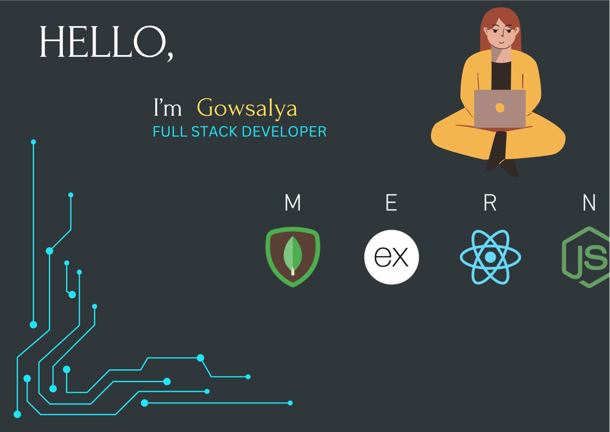

<h1 align="center">Hi ☺️,  Nice to See You Here </h1>
<h3 align="center">The Full Stack Web Development- MERN STACK</h3>

- 🌱 I’m currently learning **Full Stack Web Development-MERN**

- **I finished my HTML and CSS on UDEMY. I created the first project to create a web page for RESTANRENT. It used only HTML and CSS. Now I am learning full stack development - MERN.**

- 📫 How to reach me **gowsaa110991@gmail.com**

<h3 align="left">Connect with me:</h3>

<h3 align="left">Languages and Tools:</h3>

          
 

 

&nbsp;

